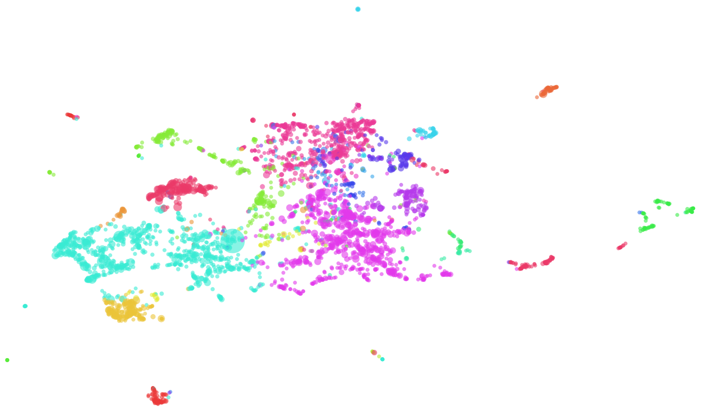
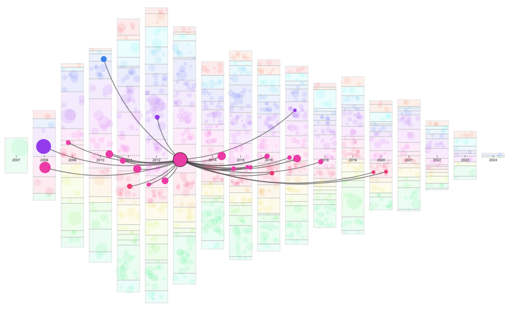
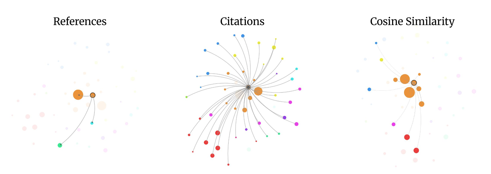

# Finding the Needle in a Haystack

For my Master Thesis I developed the Finding-The-Needle System (FTN-System), a visual analytics tool for large sets of research papers within the KATI-Lab of the Fraunhofer FKIE institute. Its source code is presented in this repository.

The system requires a direct connection to the KATI database to function, consider this repository mainly demonstrative.

## Motivation

Exponential growth of scientific literature output has created a significant "burden of knowledge" for researchers. Conventional search engines rely heavily on text-based keyword matching: either your query is to narrow, and you might miss important work, or your query is too broad, and relevant papers become few among many. While modern AI tools attempt to solve this by text retrieval and summary, they take human control out of the exploration phase, pushing researchers into bad habits and total reliance. 

The FTN-System addresses these limitations by providing a transparent, user-steered visual landscape. It transforms raw bibliographic metadata into an interactive topography, allowing researchers to explore both semantic relationships and structural citation networks to find relevant literature. You get what the broad query might return you, a couple of thousand papers, together  with the tools to make sense of them. 

You are looking for the needle in a haystack. 

## Visual Showcase
None of the views shown below are static, all of them are screenshots out of and otherwise interactive visualisation. Each datapoint represents a research paper, interaction is possible with every single visual element.
### Topic Landscape

  

The Topic Landscape View of a document set without any filters applied.

### Citation Network 

  

The Citation Flow View of a document set with rectangular cohorts visible in the background. All papers are made visible through a checkbox controlling the abstraction of the visualization. A singular paper is selected, revealing both its citations and references.

### Ego-Network 

  

The Ego-Network View of a (highly-cited) publication, changing the view to a subset of papers in the most significant academic vicinity. All three different link modes between papers are shown side-by-side. The cosine similarity denotes the semantic proximity of a paper to the rest, links are drawn if similarity is below a certain threshold.

## System Architecture

The application is structured into three primary layers: a Flask API, a Python processing backend, and a D3.js frontend.

### 1. API & Orchestration (`app.py`)
A Flask-based REST API manages background processing tasks, serves the frontend interface, and handles static file delivery.

### 2. Core Processing Backend
The central engine coordinates data acquisition, semantic embedding, clustering, and topic modeling:
* **`DocumentSetProcessor.py`**: Orchestrates the pipeline state transitions.
* **`DataHandler.py`**: Executes SPARQL queries to the KATI database and normalizes metadata.
* **`Analysis.py`**: Generates SPECTER2 semantic embeddings, performs UMAP dimensionality reduction, and calculates temporal citation flows.
* **`TopicModeling.py`**: Partitions the document set using hierarchical density-based clustering (HDBSCAN) and synthesizes human-readable topic labels using Large Language Models.

### 3. Interactive Visualization (Frontend)
The frontend is a Single-Page Application (SPA) built with D3.js. It utilizes a Coordinated Multiple Views (CMV) architecture, meaning interactions or filters applied in one view instantly update the others. The interface provides three distinct analytical perspectives:

* **Topic Landscape View**: A global 2D scatterplot projection where spatial proximity represents semantic similarity. It allows researchers to identify major thematic clusters and interdisciplinary overlaps.
* **Citation Flow View**: A chronological timeline that maps the flow of citations between different topic clusters over time, visualizing the evolution of research trends.
* **Ego-Network View**: A localized, force-directed graph focusing on the immediate neighborhood of a single selected paper. Users can adjust zero-sum sliders to weigh the importance of semantic similarity versus structural citation links.

The interface is driven by dynamic queries, allowing users to filter the corpus by publication year, impact thresholds, specific authors, or journals, with immediate visual feedback.